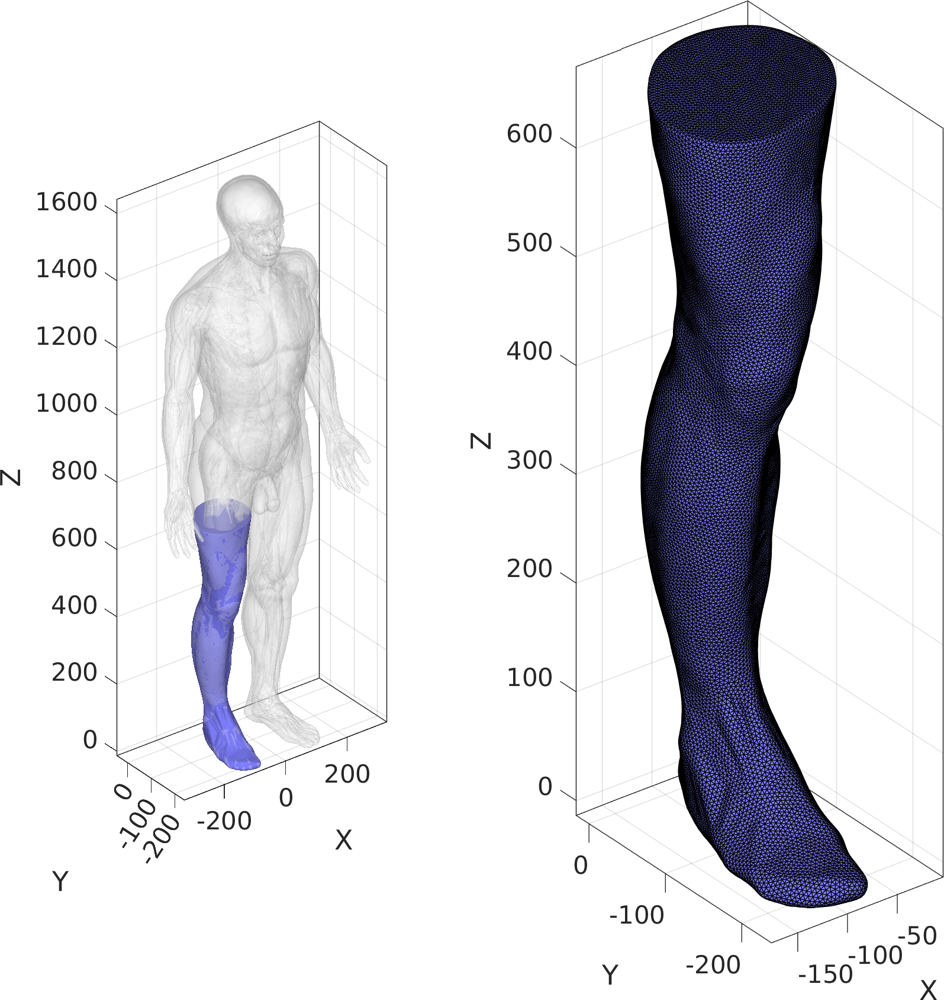
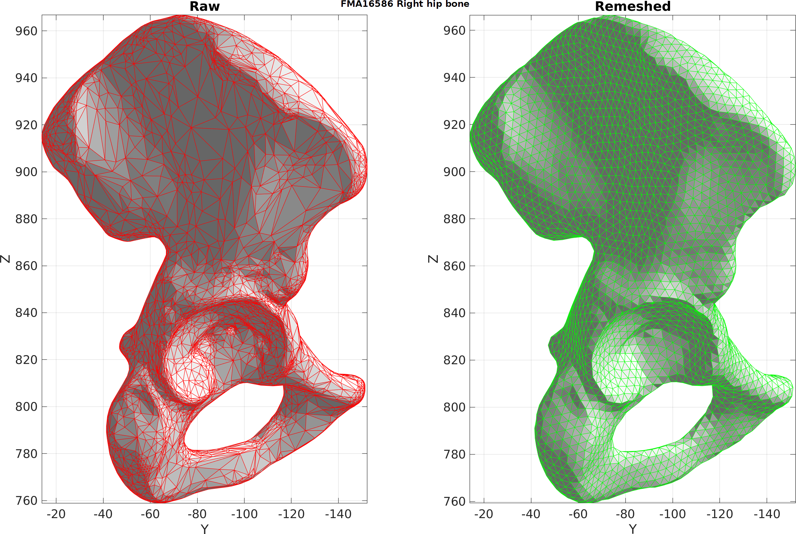
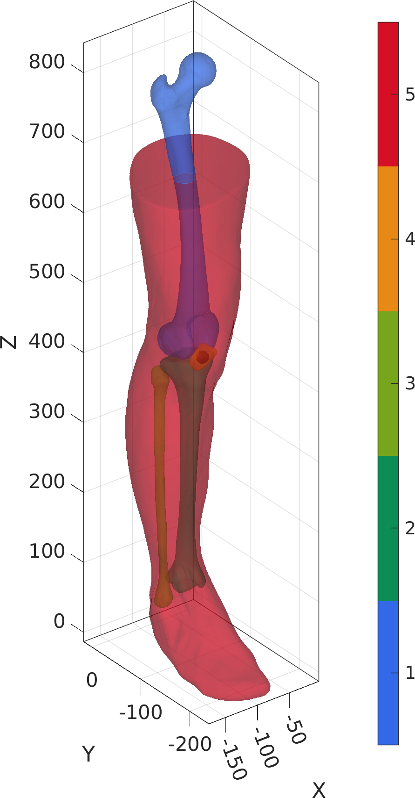
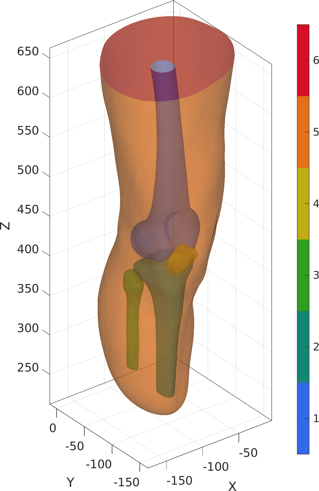

# simulateAmputation.m
Code to simulate amputation in terms of surface geometry creation for socket design based on finite element analysis.

# Dependencies
The project requires [GIBBON](https://github.com/gibbonCode/GIBBON). See also the [GIBBON](https://www.gibboncode.org/) website.

## Description

### Pre-processing
#### Leg isolation

#### Remeshing surfaces

  

### Simulated amputation

  
   

# License
https://github.com/SimuLimb/simulateAmputation.m/blob/main/LICENSE
